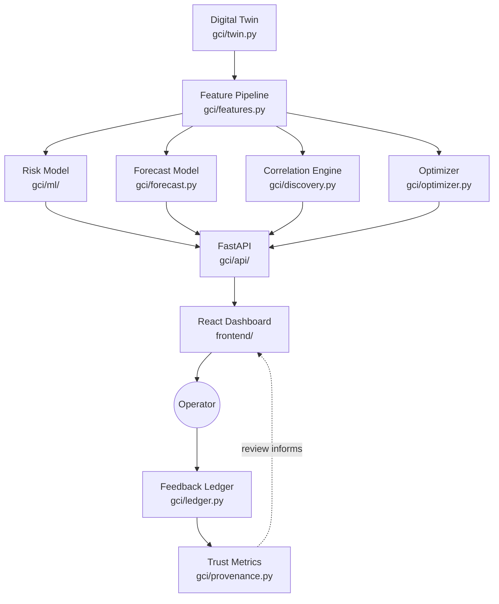

# Grade Change Intelligence (GCI)

Built for the **Honeywell Hackathon, Question 5A**.

Every automatic grade change on a paper machine risks a stretch of basis
weight running off-spec — reworked as broke rather than sold as prime, so
idle transition time is pure cost. Operators steering through a transition
today mostly have a trend line and their own judgment to go on. Grade Change
Intelligence sits beside the existing QCS / MD control package and adds a
missing layer: it predicts off-spec risk while a transition is still in
progress, explains the prediction in terms an operator already reasons in,
recommends a specific corrective setpoint change priced in dollars — up to
$6,372 in avoided off-spec production across a 100-event benchmark corpus —
and records whether the operator agreed with it, so the system earns trust
through a track record instead of asking for it up front.

> [!NOTE]
> **Advisory only.** GCI never writes to the control system. Every
> recommendation is reviewed and explicitly accepted or rejected by the
> operator, which is how advanced-control advisory products are actually
> commissioned.

---

## Key Features

✓ **Predict instability** — risk model flags off-spec probability while a transition is still in progress, not after the fact
✓ **Forecast basis weight** — quantile cone at +2 / +5 / +10 min, not a single point estimate
✓ **Recommend safe corrective actions** — setpoint optimizer proposes a specific, physically feasible plan change
✓ **Explain every recommendation** — exact SHAP attribution, in the same units an operator already reads
✓ **Source-of-inference tagging** — every suggestion is labelled learned model, physics/recipe rule, or recipe constraint, never left unattributed
✓ **Operator feedback ledger** — every accept/reject is recorded as an auditable, timestamped event
✓ **Trust scoring** — live acceptance rate and confidence calibration, not a one-time claim
✓ **ROI estimation** — every recommendation is priced in dollars, with a P10–P90 uncertainty band

---

## System Architecture



Full seven-layer breakdown, module-by-module purpose, and every design
decision behind it are in [Technical Details](#technical-details) below and
in `PROJECT_LOG.md`.

---

## Dashboard Screenshots

**Full dashboard, first load** — six panels, one per graded deliverable:


**Recommendations** — priced, provenance-tagged, accept/reject:


**Trust & ledger** — live acceptance rate and confidence calibration:


**Correlation explorer** — lagged relationships, novel vs. known loops:


More panel-by-panel screenshots, including the accept/reject round-trip and
the raw feedback ledger, are in `submission/screenshots/`.

---

## Results

Held-out test set, scored once — see [Technical Details](#technical-details)
for the full model comparison and methodology:

| Metric | Value |
|---|---|
| Event detection rate | **0.827** |
| Median warning time | **4.67 min** |
| False alarms / clean event | **0.099** |
| Forecast MAE, median (+2 / +5 / +10 min) | 0.71% / 0.89% / 0.90% |
| Forecast coverage, nominal 80% (+2 / +5 / +10 min) | 74.8% / 73.9% / 72.7% |

---

## Deliverables Mapping

| # | Honeywell deliverable | Where |
|---|---|---|
| 1 | Develop a solution to the challenge | Full stack: physics twin (`gci/twin.py`, `gci/control.py`) + 9 intelligence/decision modules + FastAPI (`gci/api/`) + React dashboard (`frontend/`) |
| 2 | Document building blocks and module communication | This README's architecture diagram + `PROJECT_LOG.md` (module-by-module design log) |
| 3 | Dashboard: new correlations, their impact, future state on current trend, suggested setpoints | `gci/discovery.py` + `gci/forecast.py` + `gci/optimizer.py`, served at `/api/correlations`, `/api/live`, `/api/recommendations`; rendered in the Correlation Explorer, Basis-Weight Off-Spec Risk, Basis-Weight Forecast, and Recommendations panels |
| 4 | Dashboard: loops/parameters driving stabilization + setpoints to stabilize faster | `gci/stabilization.py`, served at `/api/stabilization`; rendered in the Stabilization impact panel |
| 5 | Tag every suggestion with source of inference | `gci/config.py` (`Source` enum) + exact SHAP (`gci/ml/explain.py`) + `gci/provenance.py`; every advisory card shows its source tag, confidence, and a grounded explanation |
| 6 | Allow accept/reject, record responses to evaluate quality | `gci/ledger.py`, served at `POST /api/recommendations/{id}/feedback` and `GET /api/trust`; rendered in the Trust & ledger panel with live acceptance-rate and confidence-calibration feedback |

---

## Demo

Trained models ship in this repository, so the API comes up with live
predictions immediately — no training step required.

| | |
|---|---|
| Backend (local) | `http://localhost:8000` |
| Frontend (local) | `http://localhost:5173` |
| Live deployment | _add your Render / Vercel URLs here before submitting_ |

Key API endpoints (12 total, full list in `gci/api/app.py`):

| Endpoint | Purpose |
|---|---|
| `GET /api/health` | Model load status |
| `GET /api/live` | Current risk score + forecast cone for a transition |
| `GET /api/recommendations` | Priced, provenance-tagged advisories |
| `POST /api/recommendations/{id}/feedback` | Record an accept/reject decision |
| `GET /api/correlations` | Discovered lagged relationships |
| `GET /api/stabilization` | Loop sensitivity ranking |
| `GET /api/trust` | Live acceptance rate + confidence calibration |

---

## Installation

```bash
python3 -m venv .venv && source .venv/bin/activate
pip install -r requirements.txt
uvicorn gci.api.app:app --reload        # backend — http://localhost:8000
```

```bash
cd frontend && npm install && npm run dev   # frontend — http://localhost:5173
```

That's enough to see the dashboard live against the shipped, pre-trained
models. Regenerating the corpus, retraining, and running the test suite are
covered in [Technical Details](#technical-details).

---

## Technical Details

### Full architecture (seven layers)

| Layer | Contents |
|---|---|
| Operator Experience | cockpit dashboard (`frontend/`) · AI Copilot (Phase 2) · What-If Studio (Phase 2) |
| Decision & Value | ROI engine (`gci/roi.py`) · advisory ledger (`gci/ledger.py`) · provenance & trust (`gci/provenance.py`) |
| Intelligence Engine | risk predictor (`gci/ml/`) · forecast cone (`gci/forecast.py`) · correlation discovery (`gci/discovery.py`) · setpoint optimizer (`gci/optimizer.py`) · stabilization ranking (`gci/stabilization.py`) |
| Digital Twin Core | machine dynamics (`gci/twin.py`, `gci/control.py`) · recipe library (`gci/grades.py`) · event historian (`gci/events.py`) |
| Connectivity | one documented `DataSource` interface (`gci/api/datasource.py`), simulated implementation |
| Learning & Governance | feedback capture, trust scores, audit trail (`gci/ledger.py`) |
| API | FastAPI service (`gci/api/`), 12 endpoints wiring every layer above together |

### Module map

| Module | Purpose |
|---|---|
| `gci/config.py` | Spec thresholds, economics, provenance tags, advisory policy |
| `gci/grades.py` | 7-grade recipe library, 19-tag dictionary, known control-loop graph |
| `gci/twin.py` | Physics-based digital twin (mass + energy balance, FOPDT dynamics) |
| `gci/control.py` | Coordinated grade-change controller: S-curve, lead compensation, SIMC PI trim |
| `gci/faults.py` | 11 named fault types plus correlated disturbance drift |
| `gci/events.py` | Closed-loop event simulation, labelling, dataset validation |
| `gci/features.py` | 104 leak-free features, forward-looking breach labels |
| `gci/ml/` | Model registry, splits, metrics, tiered SHAP, training pipeline |
| `gci/forecast.py` | Quantile trajectory forecasting (+2/+5/+10 min basis-weight deviation) |
| `gci/roi.py` | Confidence-weighted dollar pricing + advisory surfacing policy |
| `gci/optimizer.py` | Coordinate-descent ramp/setpoint search over the twin |
| `gci/discovery.py` | Lagged correlation + mutual information + novelty scoring |
| `gci/stabilization.py` | Twin-based sensitivity ranking of plan parameters on settling time |
| `gci/provenance.py` | Unified advisory schema, grounded explanations, policy gate |
| `gci/ledger.py` | Accept/reject audit trail and quality evaluation |
| `gci/api/` | FastAPI service: connectivity layer, business logic, HTTP wiring |
| `frontend/` | React dashboard — 6 panels, one per deliverable |

### Full local setup (regenerate corpus, retrain, test)

```bash
# Generate the labelled grade-change corpus (~70 s at 1500 events, fully seed-determined)
python scripts/generate_data.py --events 1500

# Train the risk model and the forecast model
python scripts/train_risk_model.py
python scripts/train_forecast_model.py

# Run the full test suite (253 tests)
python -m unittest discover -s tests -t .
```

### Model selection and the LightGBM/XGBoost gap

Full risk-model result (Histogram Gradient Boosting), held-out test set,
scored once — the two rows above (event detection rate, median warning
time, false alarms) plus the ranking metric behind model selection:

| Metric | Value |
|---|---|
| PR-AUC | 0.827 |
| Event detection rate | **0.827** |
| Median warning time | **4.67 min** |
| False alarms / clean event | **0.099** |

Five candidate models were compared on the product objective, not just
PR-AUC. Two of the five never made it to the comparison: LightGBM and
XGBoost failed at import with `Library not loaded: @rpath/libomp.dylib` on
the development machine. That machine's Homebrew sits under the Intel
prefix while Python and the wheels are native arm64 (Apple Silicon), and no
arm64 Homebrew was present to supply the library the wheels needed.
Installing a second, parallel Homebrew just to unblock two of five
candidate models wasn't judged worth it, so the three models that would
actually run were trained instead. Histogram Gradient Boosting won anyway.

> [!NOTE]
> **Known environment limitation.** The same root cause affects the
> forecast model: its fallback quantile estimator (LightGBM's native
> quantile objective is unavailable in this environment) runs coverage at
> 72–75% against a nominal 80%. Stated plainly here rather than rounded up.
> Full numbers and per-model comparisons: `models/evaluation_report.md`,
> `PROJECT_LOG.md` §9.

### Setpoint optimizer benchmark

Benchmarked across a 100-event demo corpus — every transition re-planned
exactly as the dashboard's "Recommended plan" card does, baseline vs.
optimizer-recommended plan on the twin:

| Metric | Value |
|---|---|
| Transitions where the recommendation reduces off-spec time | **57.0%** (57/100) |
| Off-spec minutes avoided, mean / median / P95 | 1.79 / 0.25 / 7.84 min |
| Recommended-plan value, mean / median | $64 / $8 |
| Total priced value across the corpus | $6,372 |

The other 43% aren't failures — many logged baselines are already
near-optimal, so zero improvement means the optimizer found nothing better.
Regenerate with `python scripts/benchmark_stabilization.py`; per-event
detail is in `models/benchmark.json` and `models/benchmark_report.md`.

### Recommendations vs. insights

Two kinds of dashboard content, deliberately kept apart. Recommendations —
tagged `Physics / recipe rule`, `Recipe constraint`, `Learned model` — are
actionable: a priced plan change with an accept/reject control. Insights,
like the Correlation Explorer and Stabilization impact panels, are
diagnostic instead: what the data or the twin reveals, with no single
action attached. Insights aren't priced or gated like recommendations —
that would either under-price a real diagnostic or over-claim certainty for
an exploratory finding.

### Why the physics is trustworthy

The twin is first-principles where it matters:

```
basis weight = retained dry mass rate / sheet area rate    (mass balance)
ash          = retained filler / total retained solids     (mass balance)
moisture     = water load / drying capacity                (energy balance)
caliper      = basis weight / apparent density              (empirical)
```

Quality variables reach steady state through first-order-plus-dead-time
dynamics. That's why grade changes are hard: by the time the scanner sees a
deviation, its cause is already 30–60 seconds in the past.

Verification is by property, not by eyeballing curves. The test suite
asserts mass conservation, response direction, dead-time enforcement,
time-constant magnitude, convergence to the analytic steady state, and
absence of future leakage in the feature set (`test_no_future_leakage`).

### Data

The corpus is regenerated, not shipped. It's fully determined by its seed,
so `--seed 20260725` reproduces the exact dataset behind these results.

| | |
|---|---|
| Events | 1,500 grade changes, 42 distinct grade pairs |
| Window | 30 min at 5 s sampling |
| Off-spec rate | 62.5% (deliberately high, by design, to keep the problem learnable — see `PROJECT_LOG.md` known limitation 5) |
| Feature samples | 504,000 × 104 |
| Generation time | ~72 s |

**253 tests passing, 0 failing**, 25 of which exercise API robustness
against malformed input (`tests/test_robustness.py`).

### No public dataset

Question 5A asks for an intelligence layer on a paper machine's existing
grade-change sequence: predict off-spec risk, explain why, recommend a fix,
price it, and let the operator accept or reject it so the system gets
judged on real usage, not on paper. No public dataset of instrumented grade
changes exists, so the foundation everything else sits on is the
physics-grounded digital twin above, simulating the corpus instead of
faking one. See `PROJECT_LOG.md` §6, decision D1, for the full reasoning.

See **`PROJECT_LOG.md`** for the full status, every design decision and its
rationale, assumptions, and known limitations — the project's source of
truth, updated after every module.

---

## Team

Mohammad Kamil — solo entry.

## License

No license has been applied to this repository; all rights reserved by
default. Contact the author for reuse.
